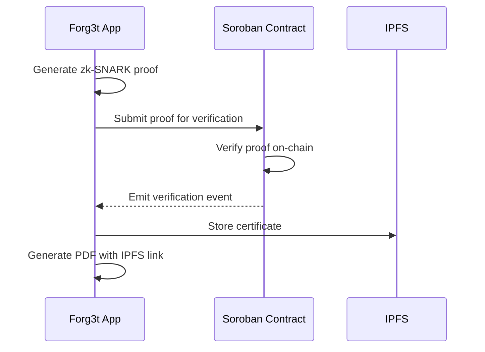
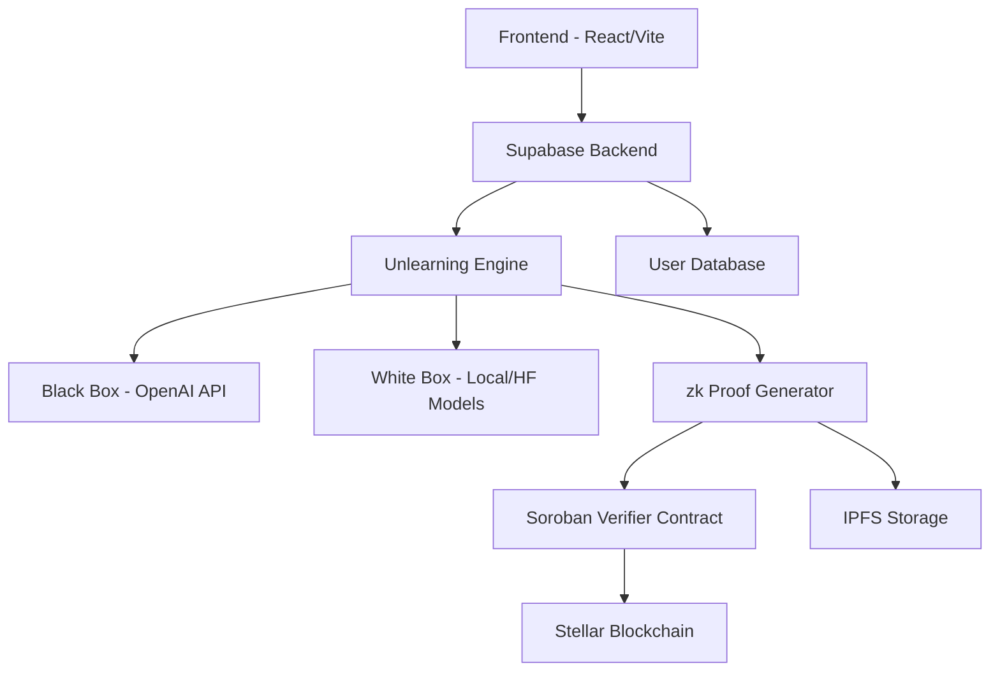

# Forg3t Protocol

AI unlearning with zk-SNARK proofs and Stellar blockchain verification

[](https://img.shields.io/badge/CI-not%20yet%20configured-orange)
[](https://img.shields.io/badge/license-MIT-blue)
[](https://img.shields.io/badge/code%20style-prettier-ff69b4)
[](https://img.shields.io/badge/docs-not%20yet%20available-lightgrey)

## What is Forg3t

The Forg3t Protocol enables provable AI unlearning - the cryptographic removal of specific information from AI models. Organizations can ensure sensitive data is permanently forgotten by AI systems while generating verifiable certificates of compliance.

Our solution combines adversarial testing, zero-knowledge proofs, and blockchain verification to create an immutable audit trail. Unlike simple data deletion, Forg3t provides cryptographic evidence that information has been effectively removed from model behavior.

## Stellar and Soroban Integration

The protocol leverages Stellar blockchain with Soroban smart contracts for on-chain proof verification:

- **Soroban Verifier Contract**: Validates zk-SNARK proofs and records verification results
- **On-Chain Events**: Emits verification success/failure events for audit trails
- **4GET Token**: Planned utility for verification fees and validator incentives



## Architecture



### Components

- **Frontend**: React + TypeScript, Vite, Tailwind CSS
- **Backend**: Supabase with serverless functions
- **Unlearning Engine**: Black-box (OpenAI) and white-box (local/Hugging Face) modules
- **zk Proof Generator**: Creates and verifies SNARK proofs
- **Soroban Contract**: On-chain proof verification
- **IPFS Storage**: Certificate and artifact storage
- **Proof Indexer**: Planned component for proof discovery

## Quick Start

### Prerequisites

- Node.js LTS
- npm or pnpm
- Supabase CLI
- Stellar SDK

### Setup

1. Clone the repository
2. Install dependencies:
   ```bash
   npm install
   ```

3. Create `.env` file with:
   ```env
   SUPABASE_URL=your_supabase_url
   SUPABASE_ANON_KEY=your_supabase_anon_key
   OPENAI_API_KEY=your_openai_api_key
   PINATA_API_KEY=your_pinata_api_key
   PINATA_API_SECRET=your_pinata_api_secret
   STELLAR_NETWORK=testnet
   SOROBAN_RPC_URL=your_soroban_rpc_url
   FORG3T_CONTRACT_ID=your_contract_id
   FORG3T_TOKEN_CODE=4GET
   ```

4. Run development server:
   ```bash
   npm run dev
   ```

## Scripts

- `npm run dev`: Start development server
- `npm run build`: Build for production
- `npm run test`: Run tests
- `npm run lint`: Lint code
- `npm run format`: Format code
- `npm run typecheck`: Check TypeScript types
- `npm run deploy-contract`: Deploy Soroban contract to testnet
- `npm run verify-proof`: Run sample proof verification

## Database Schema

### Users
```sql
CREATE TABLE users (
  id UUID PRIMARY KEY,
  email TEXT UNIQUE NOT NULL,
  package_type TEXT DEFAULT 'individual',
  created_at TIMESTAMPTZ DEFAULT NOW()
);
```

### Unlearning Requests
```sql
CREATE TABLE unlearning_requests (
  id UUID PRIMARY KEY DEFAULT gen_random_uuid(),
  user_id UUID REFERENCES users(id),
  request_reason TEXT NOT NULL,
  status TEXT DEFAULT 'pending',
  processing_time_seconds INTEGER,
  blockchain_tx_hash TEXT,
  audit_trail JSONB,
  created_at TIMESTAMPTZ DEFAULT NOW()
);
```

### Proofs
```sql
CREATE TABLE proofs (
  id UUID PRIMARY KEY DEFAULT gen_random_uuid(),
  request_id UUID REFERENCES unlearning_requests(id),
  proof_data JSONB,
  verification_status TEXT,
  created_at TIMESTAMPTZ DEFAULT NOW()
);
```

### Certificates
```sql
CREATE TABLE certificates (
  id UUID PRIMARY KEY DEFAULT gen_random_uuid(),
  request_id UUID REFERENCES unlearning_requests(id),
  ipfs_hash TEXT,
  pdf_data BYTEA,
  created_at TIMESTAMPTZ DEFAULT NOW()
);
```

## API and Function Endpoints

- `POST /functions/create-request`: Create new unlearning request
  - Request: `{ user_id, target_text, reason }`
  - Response: `{ request_id, status }`

- `POST /functions/run-suppression`: Execute black-box suppression
  - Request: `{ request_id, api_key, target_text }`
  - Response: `{ success, leak_score, results }`

- `POST /functions/generate-proof`: Create zk-SNARK proof
  - Request: `{ request_id, test_results }`
  - Response: `{ proof_id, proof_data }`

- `POST /functions/store-ipfs`: Save certificate to IPFS
  - Request: `{ certificate_data }`
  - Response: `{ ipfs_hash }`

- `POST /functions/submit-proof`: Verify proof on Stellar
  - Request: `{ proof_data }`
  - Response: `{ tx_hash, verification_status }`

- `POST /functions/issue-certificate`: Generate PDF certificate
  - Request: `{ request_id, verification_data }`
  - Response: `{ certificate_id, download_url }`

## Compliance and Security

The protocol aligns with GDPR Article 17 (Right to Erasure) by providing cryptographic evidence of information removal from AI systems.

### Security Features

- Audit-ready logs for all unlearning operations
- PII handling through target text anonymization
- Encryption at rest for sensitive database fields
- Cryptographic signing of all PDF certificates
- Optional OpenAI integration (can be disabled)

### Threat Model

- [Planned] Detailed threat model in `docs/threat_model.md`

## Roadmap

### MVP Testnet Goals
- Soroban verifier contract implementation
- Stellar SDK v0 integration
- Demo application with proof verification

### Mainnet Goals
- SDK v1 release
- Enhanced dashboard with metrics
- Proof indexer for discovery
- Third-party security review

### White Box Rollout
- Local model weight manipulation
- Hugging Face integration
- Multiple unlearning techniques

### Public Goods Award Path
- Ongoing maintenance and improvements
- Community contribution guidelines
- Documentation and educational resources

## Contribution

Contributions are welcome! Please read our contribution guidelines and code of conduct before submitting pull requests.

## License

MIT License - see LICENSE file for details