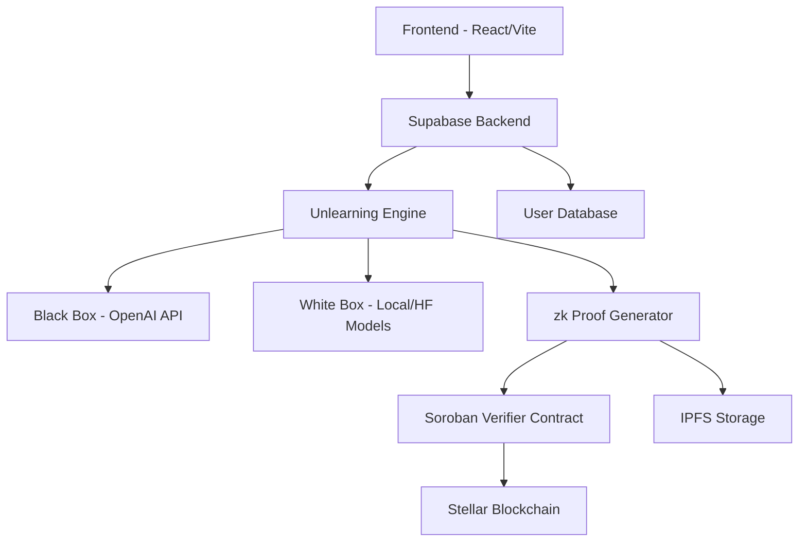
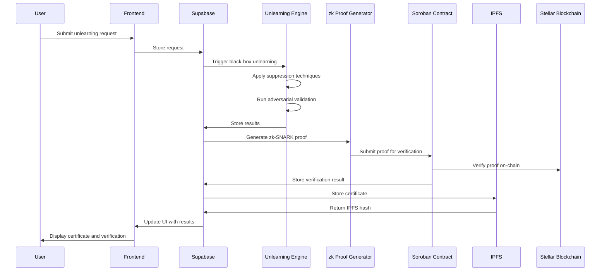

# Forg3t Protocol Architecture

## High-Level Architecture

## Component Overview

### 1. Frontend (React + Vite)
- User interface for submitting unlearning requests
- Dashboard for monitoring unlearning progress and results
- Certificate viewing and management
- Integration with Supabase authentication

### 2. Supabase Backend
- User authentication and management
- Data storage for unlearning requests, results, and certificates
- Serverless functions for processing requests
- Real-time updates and notifications

### 3. Unlearning Engine
#### Black Box Module
- Integrates with OpenAI API for instruction-based unlearning
- Applies suppression techniques to AI models
- Runs adversarial validation tests
- Measures effectiveness through leak detection

#### White Box Module (Planned)
- Direct manipulation of model weights
- Gradient ascent techniques for unlearning
- Embedding removal and neural surgery
- Local model support and Hugging Face integration

### 4. zk Proof Generator
- Creates zero-knowledge SNARK proofs of unlearning
- Ensures cryptographic verification of information removal
- Generates proof artifacts for blockchain submission
- Integrates with snarkjs library

### 5. Soroban Verifier Contract
- Smart contract on Stellar blockchain
- Verifies zk-SNARK proofs on-chain
- Emits events for audit trails
- Records verification results permanently

### 6. IPFS Storage
- Decentralized storage for certificates and artifacts
- Integration with Pinata for reliable pinning
- Content addressing for immutable storage
- Metadata management for certificate retrieval

### 7. User Database
- Stores user profiles and preferences
- Tracks unlearning requests and their status
- Maintains audit trails and processing history
- Manages certificate metadata and IPFS hashes

## Technical Flow

## Data Flow

1. **User Request**: User submits target information for unlearning through the frontend
2. **Request Processing**: Supabase stores the request and triggers the unlearning engine
3. **Black-Box Unlearning**: OpenAI-based suppression techniques are applied
4. **Validation**: Adversarial tests verify information removal
5. **Proof Generation**: zk-SNARK proof is created from test results
6. **Blockchain Verification**: Proof is submitted to Soroban contract for verification
7. **Certificate Creation**: PDF certificate is generated with verification details
8. **Storage**: Certificate is stored on IPFS and metadata is saved in Supabase
9. **User Notification**: User receives confirmation with certificate and verification details

## Security Considerations

- All sensitive data is encrypted at rest
- API keys are securely managed through environment variables
- Zero-knowledge proofs ensure verification without revealing sensitive information
- Blockchain verification provides immutable audit trails
- PDF certificates are cryptographically signed for authenticity